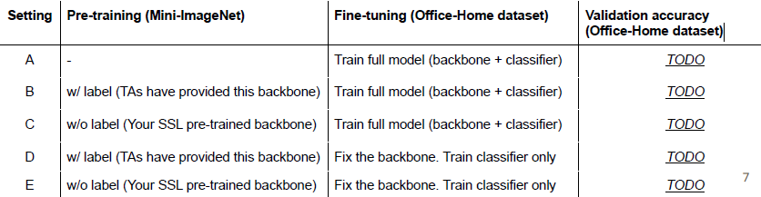

# environment 
- final testing(3 days before submission): on ubuntu-22.04
- python version 3.8 

# coding
- p1
    - training.py
        - dataset setting
        - model structure
        - 1) pre-train the backbone: SSL on the ***Mini-ImageNet*** without loading default pretrained weights.
        - 2) downstream task: Image classification on ***Office-Home dataset*** .
        - 3) experiment on two pretrain method: w/ label(supervised, TA provided) and w/o label(SSL, we need to do it ourself) 
        - 
    - inference.py
    - environment testing 
- p2
# report

